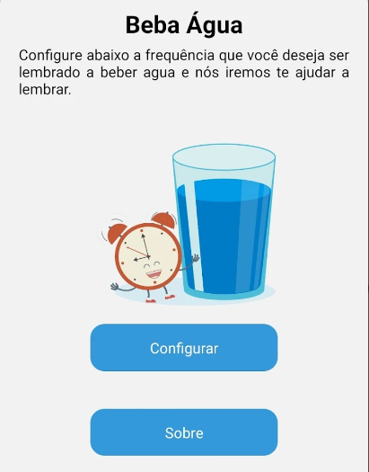

# Aplicativo Beba Água

Um aplicativo simples para notificar sobre o consumo de agua.



### ⬇️ Download

* [Beba Água - Lembrete](https://play.google.com/store/apps/details?id=com.markwareco.drinkwater&pli=1)

### 📋 Pré-requisitos

* Node >= 15


### 🔧 Instalação

Para realizar a instalação:

```
git clone https://github.com/lippelima5/drink-water 

cd drink-water 

yarn install ou npm install

```
## 🖇️ Colaborando

Este é um projeto totalmente livre que aceita contribuições via pull requests no GitHub. Este documento tem a responsabilidade de alinhar as contribuições de acordo com os padrões estabelecidos no mesmo. Em caso de dúvidas, [abra uma issue](https://github.com/lippelima5/drink-water/issues/new).

### Primeiros passos
* Fork este repositório.
* Envie seus commits em português.
* Solicite a pull request.
* Insira um pequeno resumo dos links adicionados.

## ✒️ Autores

Colaboradores e Desenvolvedores do projeto:

* **Felippe** - *Desenvolvimento integral* - [Felippe](https://github.com/lippelima5)


---
⌨️ com ❤️ por [Felippe Lima](https://github.com/lippelima5) 😊
